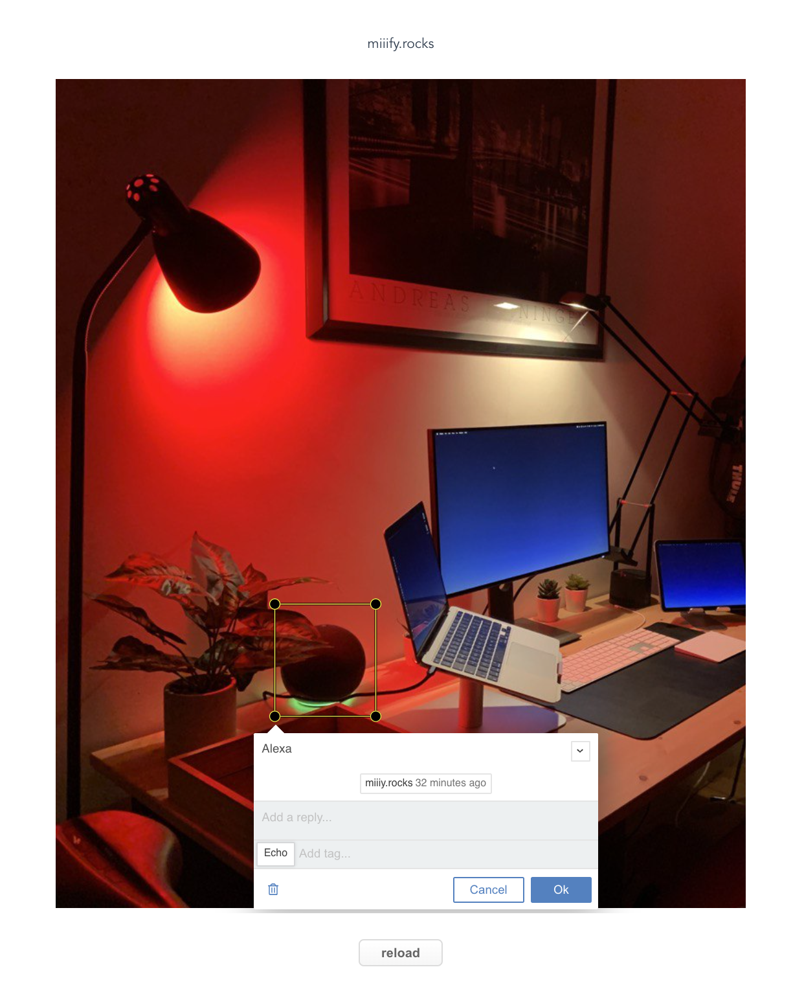

# miiifyapp

Simple demo app to annotate an image. 

### Get the app and annotation db (uses [GitHub CLI](https://github.com/cli/cli))
```
gh repo clone https://github.com/jptmoore/miiifyapp.git
cd miiifyapp
gh repo fork --clone https://github.com/jptmoore/annotations.git db
```

### Install dependencies
```
npm install
```

### Start miiify backend (requires Docker)
```
npm run backend
```

### Start demo
```
npm run serve
```

Visit http://localhost:8080/ and annotate the image by drawing a rectangle with your mouse.

